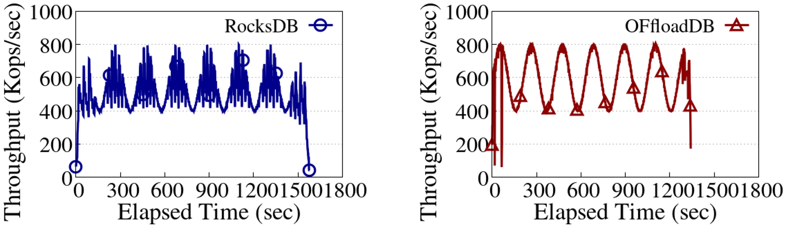
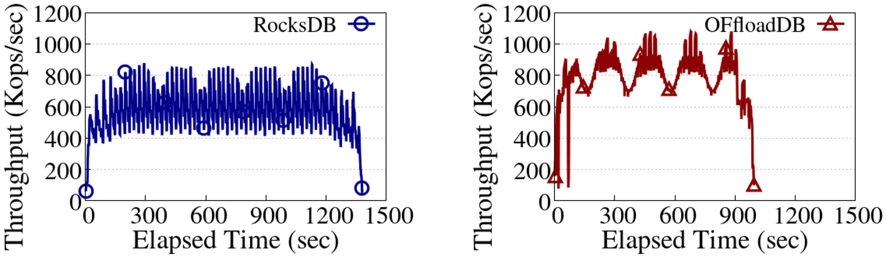
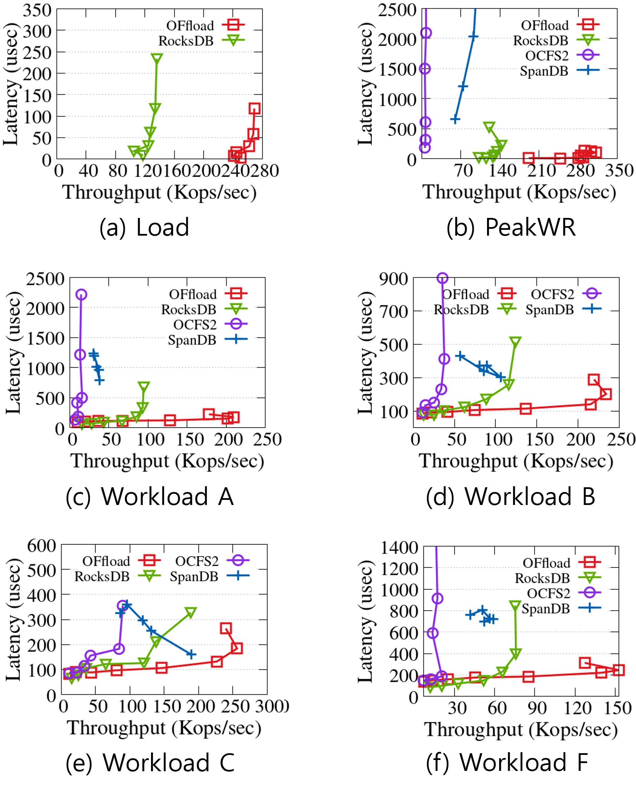
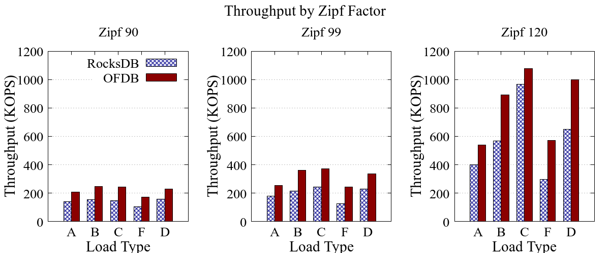
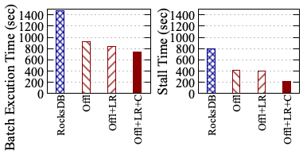

## More Experiments

 
 
 

### [mixgraph (variable-sized values, Varying arrival rate)]

#### [Light]

#### [Heavy]

 
 

### [latency-throughput (Different thread numbers)]

SpanDB does not support workload D. 
SpanDB crashes during the YCSB Load workload, which involves inserting dozens of gigabytes of data.  
To work around this and measure write performance, we followed the approach of the SpanDB authors.  
First, we load 200 GB of data using vanilla RocksDB. Then, we open the database with SpanDB and run a 100% write workload, performing an additional 20 million writes.  
This workload is called "PeakWR."  
 
 

### [Throughput varying Zipf Factor]

 
 

### [Impact of Designs on Execution Time and Write Stall]

